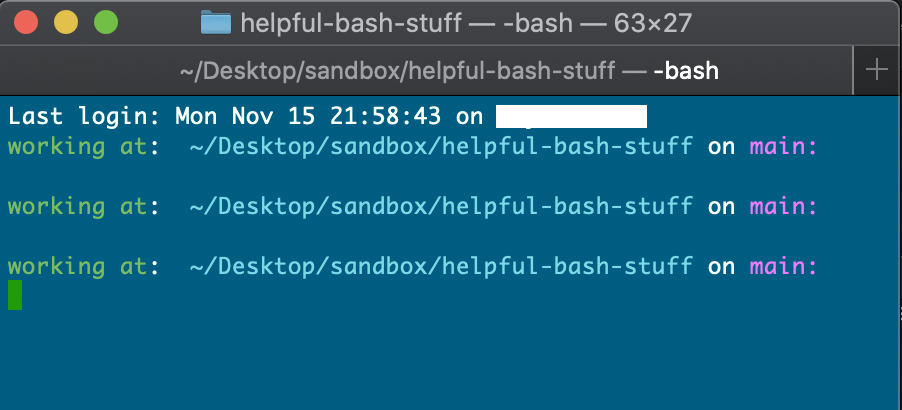
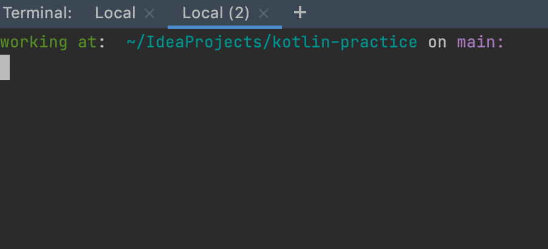
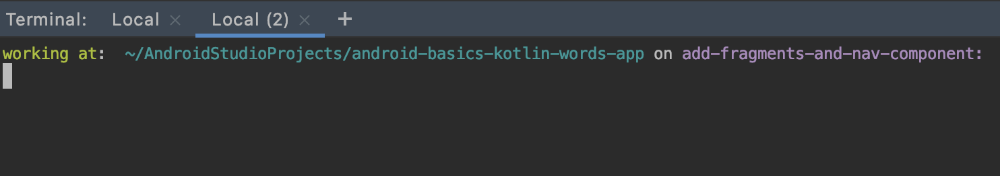

# Helpful Bash Profile 

I know bash is old news and `.zsh` is the latest and greatest more powerful command line tool but tbh I don't do anything too powerful in the command line, mostly just moving things around and running git commands. So, here's some useful bash profile stuff I like. 

The follow file (`useful-bash-profile`) will get your terminal window looking like: 

### General Terminal Look:

### IntelliJ Look: 

### Android Studio Look:
